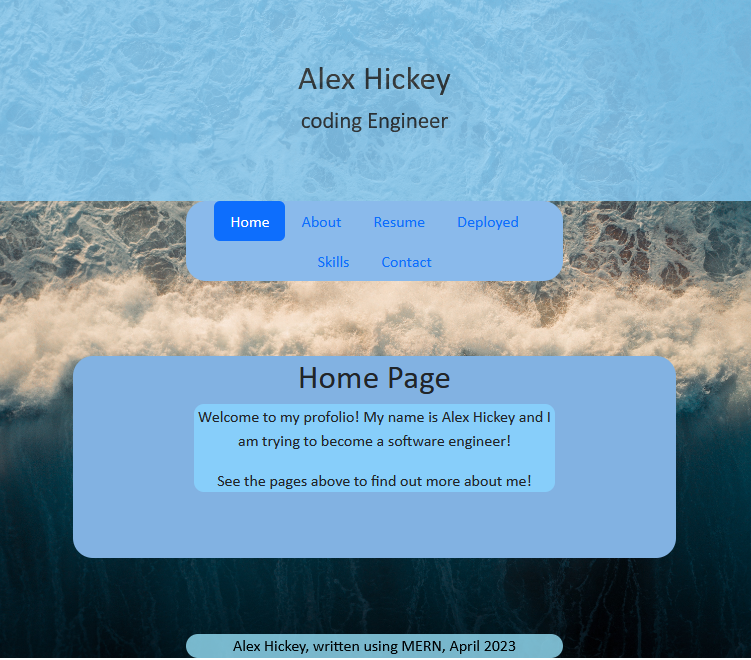

# react-portfolio
New portfolio using react and api examples

## Description

This is my portfolio. It will be updated often when I finish working on a new project. This react portfolio was built froms scratch using minimal code to start the project. All content within is my personal info!

Link!
https://axelpanic.github.io/react-portfolio/

- [Installation](#installation)
- [Usage](#usage)
- [Credits](#credits)
- [License](#license)

## Installation
npm install
npm run start or npm run build

## Screenshot

## Credits

React, bootstrap, and BCS

## License
MIT CC @Axelpanic (alex Hickey)
